# Ex1

网络应用通信基本原理

## 1、DNS\HTTP\FTP\POP\SMTP报文捕捉截图

DNS查询报文：
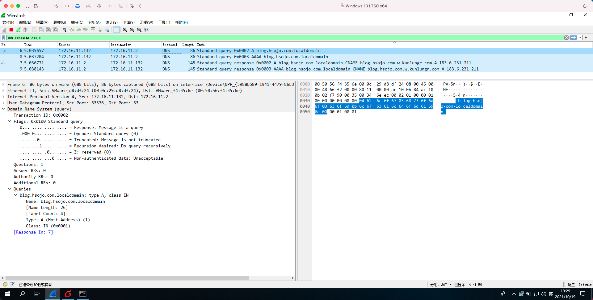

DNS响应报文：
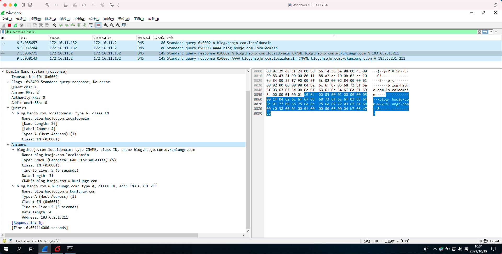

HTTP请求报文：
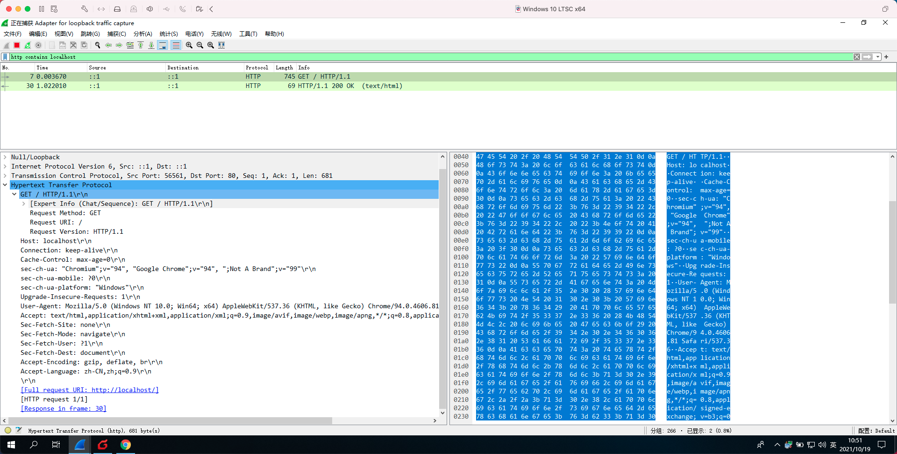

HTTP响应报文：
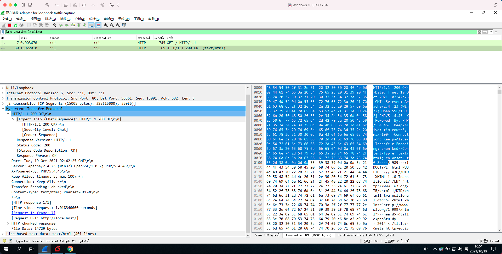

FTP报文：
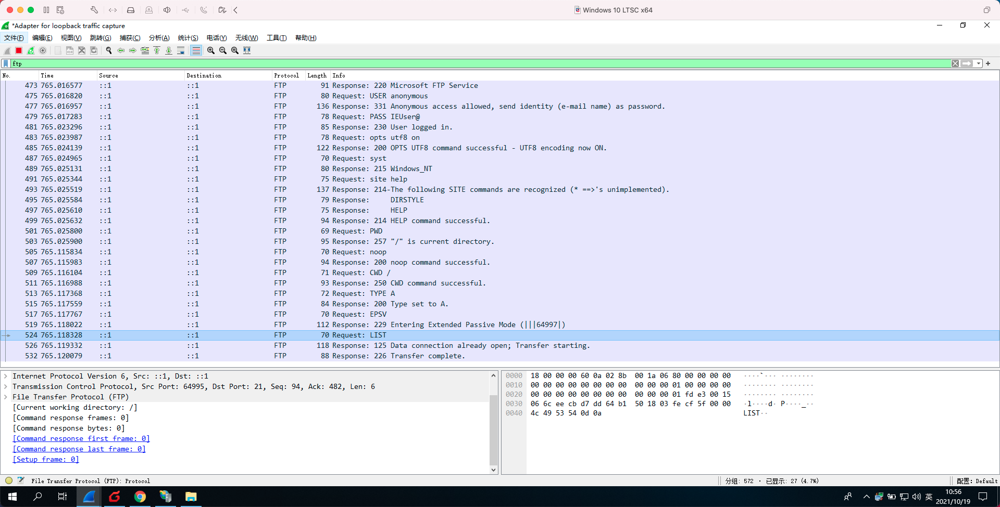

POP报文：
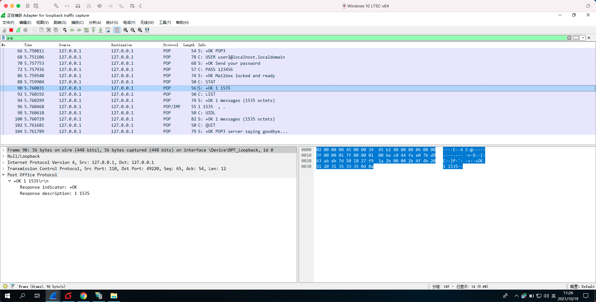

SMTP报文：
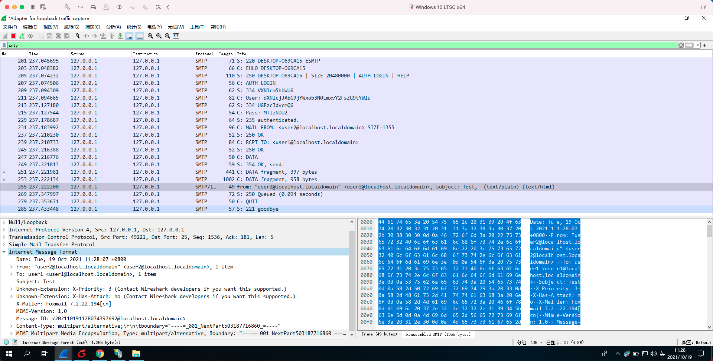

## 2、Internet五层协议栈报文封装分析，字节计算；

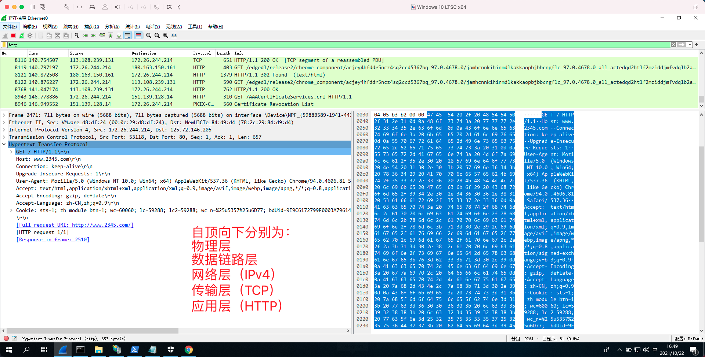

在Wireshark中逐层展开点击，可以得到每一层数据部分的大小，如图选中的HTTP请求部分数据，在左下角可以看到数据尺寸为657 Bytes。

数据总长度=657（HTTP Request）+20（TCP头部）+20（网络层头部）+14（以太帧头部）=711 Bytes

## 3、DNS query与query response过程分析，PDU封装分析(可以只分析query)；

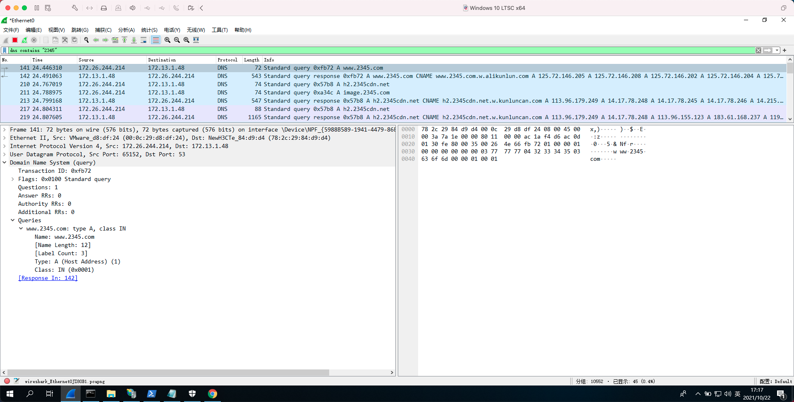

Query数据总长度=30（DNS query）+8（UDP头部）+20（网络层头部）+14（以太帧头部）= 72 Bytes

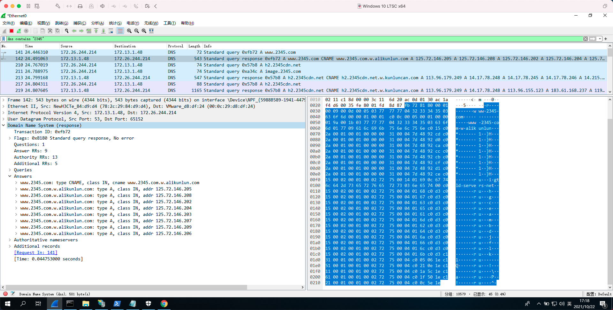

Query Response数据总长度=501（DNS query response）+8（UDP头部）+20（网络层头部）+14（以太帧头部）= 543 Bytes

由图可知，DNS query与query response一般成对出现，发送query数据包到DNS服务器后，服务器会返回query response数据包；在response中包含域名解析的相关信息。

## 4、HTTP过程分析，HTTP request与response PDU封装分析；

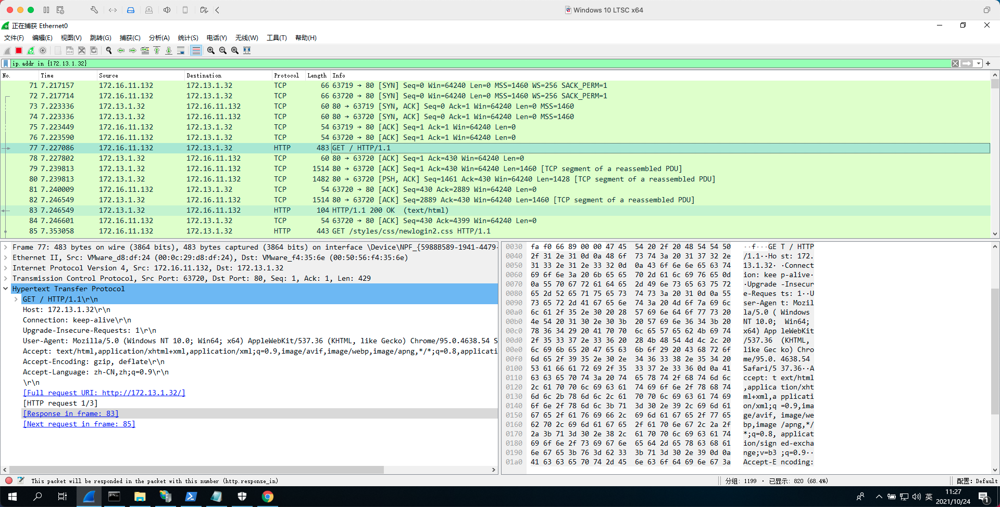

HTTP Request数据总长度=429（HTTP Request）+20（TCP头部）+20（网络层头部）+14（以太帧头部）= 483 Bytes

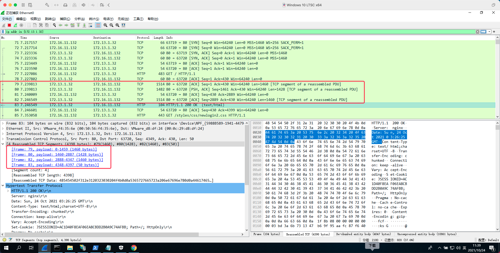

HTTP Response数据总长度 = 1460（分块1）+ 1428（分块2）+ 1460（分块3）+ 50（分块4）+ 4 * (20 + 20 + 14) = 4614 Bytes

由以上分析可知，HTTP协议通过Request以及Response完成服务端与客户端的交互，客户端发送Request数据包，服务器接受并处理后返回Response数据包；对于尺寸较大的Response包，TCP协议会将其进行分片发送；在一般情况下，服务器会对响应内容进行压缩（gzip）以减少所需发送数据的大小。

## 5、SMTP过程及PDU封装分析（POP可不进行分析）

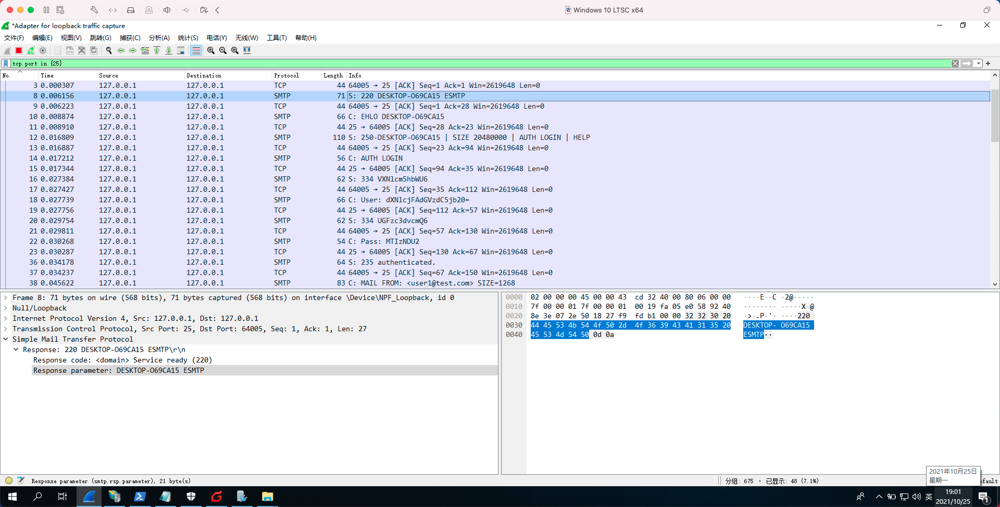

数据总大小 = 27（SMTP指令）+ 20（TCP头部）+ 20（网络层头部）+ 4（回环帧头部）= 71 Bytes
SMTP协议用于邮件发送，是基于TCP连接的有状态协议，客户端发件时，需先与服务器建立连接，用户名密码验证通过后，方可执行相应指令完成邮件发送。

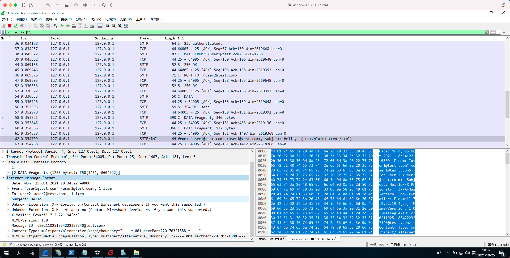

邮件发送完成后，客户端（Foxmail）会自动断开SMTP连接。

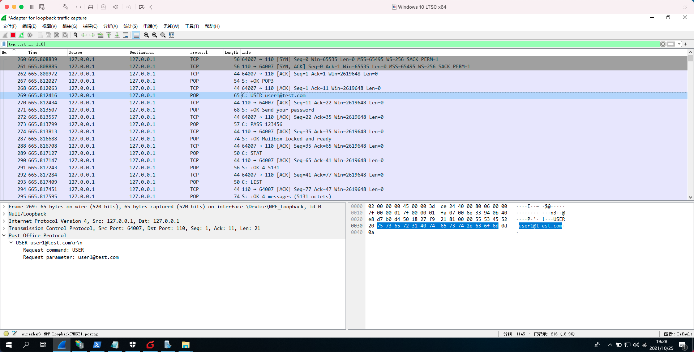

邮件接收通过POP协议进行，POP与SMTP一样是有状态协议，需要与服务器建立连接，并完成用户验证后才可以进行操作；用户收件时，会对邮箱进行锁定操作，客户端执行LIST指令后，服务器返回邮件列表数据，完成后客户端（Foxmail）会自动断开连接。

## 6、FTP过程分析，PDU封装分析

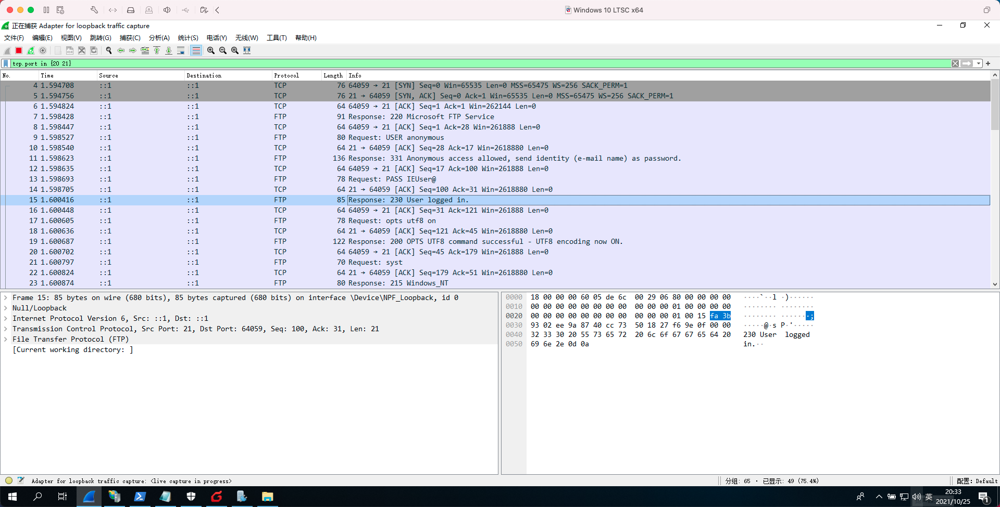

数据总大小 = 21（FTP响应内容）+ 20（TCP头部）+ 40（网络层头部）+ 4（回环帧头部）= 85 Bytes
FTP用于进行文件传输，同样是有状态协议，需要完成连接、用户认证后才可以进行操作，FTP使用两个端口，21端口用于逻辑控制，发送操作指令；而20端口则是用于进行数据传输。

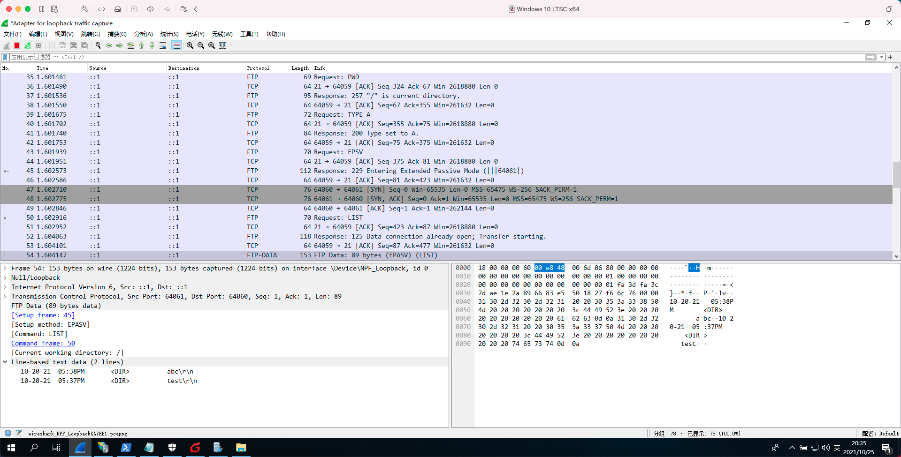

执行对应的指令后，FTP服务器会返回对应的操作结果，如LIST则返回目录的文件列表。

## 7、针对User-Agent的网站编程

有Session和Cookie的，需要提供IP地址和登陆账号供老师检验。

* 参见[UATest](https://github.com/NUIT-OPEN/UATest)
