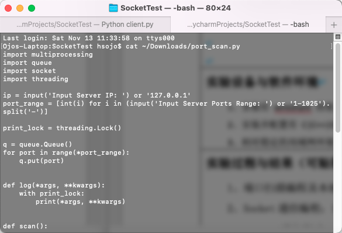
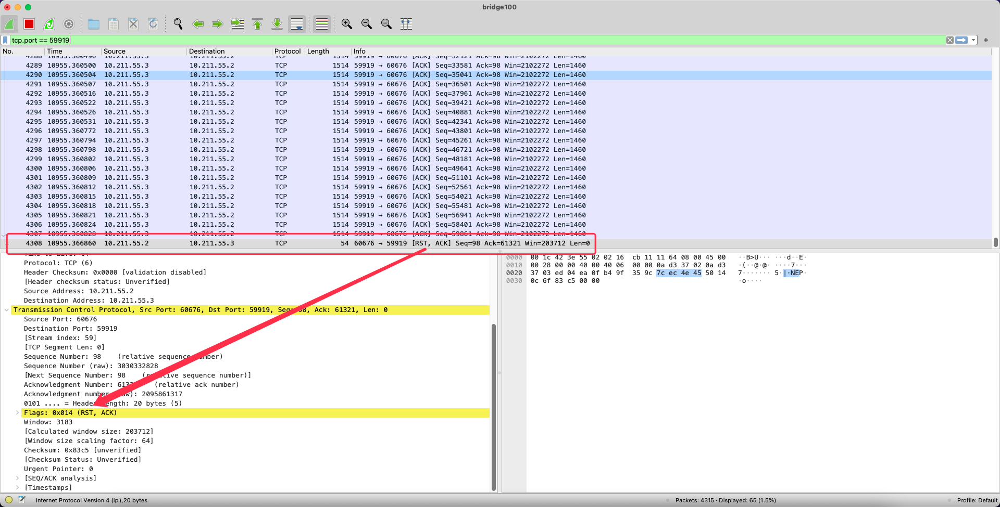

# Ex2

Socket通信编程与传输协议分析

## 1. 端口扫描编程及本地服务器测试

* 参见[port_scan.py](port_scan.py)

* 运行结果如下所示

## 2. Socket通信编程

通过使用TCP Socket实现了一个简单的文件传输工具。

* 服务端参见[server.py](server.py)
* 客户端参见[client.py](client.py)

## 3. Socket 通信测试

支持使用任何网络环境测试，以下是使用虚拟机进行测试的结果：
 

## 4. 传输层协议及通信过程分析(建立连接，发送数据，拆除连接)
 

## 5. 报文分段测试分析Segment

如图所示，该大文件被分为了数十个segment。

## 6. RST复位测试分析

当程序发送数据异常，或网络断开时，服务器会发送RST报文到客户端并断开连接。

## 7. WEBSOCKET编程测试与分析

建立WebSocket前，客户端需要先发送HTTP请求，得到101响应后，便会切换协议，建立WebSocket连接。

