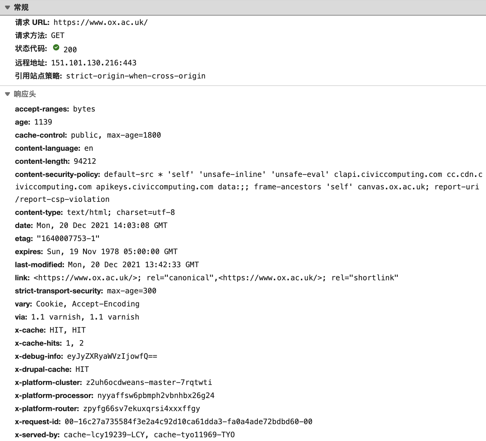
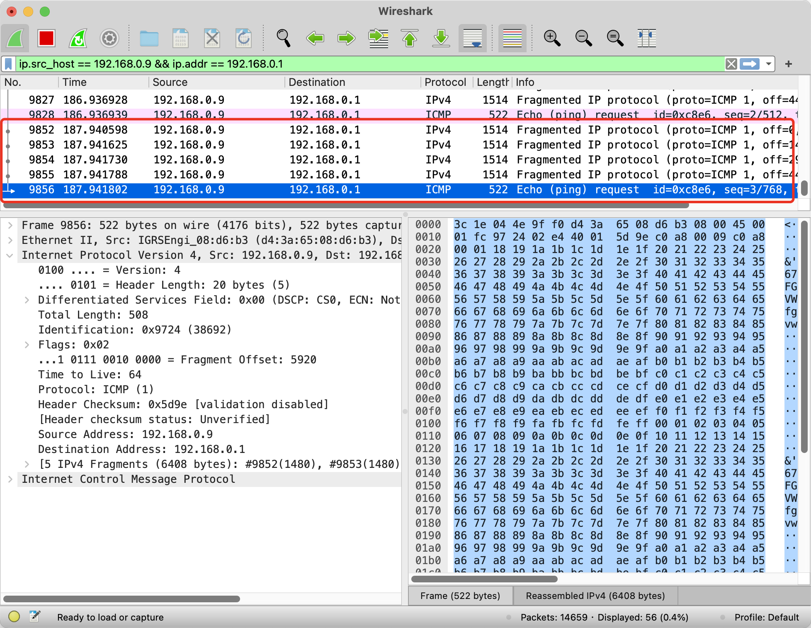
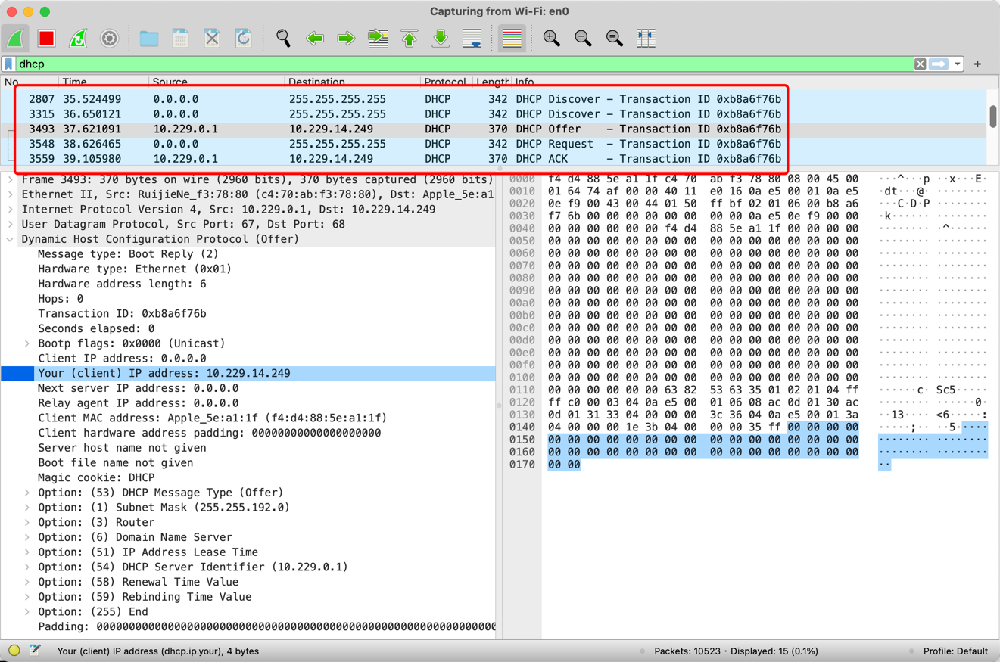

# Ex3

IP协议及动态路由算法

## 1. ping和tracer route测试；

```log
C:\Users\User>tracert www.ox.ac.uk

通过最多 30 个跃点跟踪
到 www.ox.ac.uk [151.101.66.216] 的路由:

  1    <1 毫秒   <1 毫秒   <1 毫秒 UBUNTU [192.168.122.1]
  2     1 ms     1 ms     1 ms  192.168.0.1
  3     6 ms     2 ms     2 ms  10.225.96.1
  4     2 ms     2 ms     2 ms  10.228.0.6
  5     *        *        *     请求超时。
  6     3 ms     3 ms     3 ms  119.145.153.1
  7     4 ms     7 ms     5 ms  113.98.154.1
  8     5 ms     4 ms     4 ms  113.98.177.185
  9     7 ms     *        *     202.97.94.130
 10     8 ms    15 ms    12 ms  202.97.12.25
 11   160 ms   160 ms   160 ms  202.97.94.14
 12   165 ms   165 ms   164 ms  ae-3.r31.tokyjp05.jp.bb.gin.ntt.net [129.250.3.29]
 13   165 ms   165 ms   165 ms  ae-3.r00.tokyjp08.jp.bb.gin.ntt.net [129.250.6.129]
 14   167 ms   167 ms   166 ms  ae-1.fastly.tokyjp08.jp.bb.gin.ntt.net [61.200.82.50]
 15   164 ms   164 ms   164 ms  151.101.66.216

跟踪完成。
```

验证了从源地址到目的地址的转发表，经过15跳到达，路途经过的节点查询IP所在地，即可得到路径。

```log
C:\Users\user>ping www.ox.ac.uk

正在 Ping www.ox.ac.uk [151.101.194.216] 具有 32 字节的数据:
来自 151.101.194.216 的回复: 字节=32 时间=174ms TTL=128
来自 151.101.194.216 的回复: 字节=32 时间=174ms TTL=128
来自 151.101.194.216 的回复: 字节=32 时间=174ms TTL=128
来自 151.101.194.216 的回复: 字节=32 时间=173ms TTL=128

151.101.194.216 的 Ping 统计信息:
    数据包: 已发送 = 4，已接收 = 4，丢失 = 0 (0% 丢失)，
往返行程的估计时间(以毫秒为单位):
    最短 = 173ms，最长 = 174ms，平均 = 173ms
```

使用Ping 探测该域名，Windows系统中默认发送4个32bytes的ECHO。 Ping不能完全确保目标主机是否可访问，有些服务器为了防止通过Ping探测到，通过防火墙设置了禁止Ping或者在内核参数中禁止Ping。

TTL为128，128+15-1=142,根据TTL以及响应头，无法判断服务器操作系统的类型。



使用Ping 和 Tracer route，以及Nslookup并不能完全保证得到确切的网站对应的IP地址(很多WEB使用反向代理、CDN、负载均衡等技术)，部分网站会使用基于反向代理的内容分发网络(CDN, Content
Delivery Network)技术。

## 2. IP数据报分片计算、验证(必须分4片及以上，不可5200bytes)；

```log
Ojos-MacBook-Pro:~ user$ ping 192.168.0.1 -s 6400
PING 192.168.0.1 (192.168.0.1): 6400 data bytes
6408 bytes from 192.168.0.1: icmp_seq=0 ttl=128 time=68.074 ms
6408 bytes from 192.168.0.1: icmp_seq=1 ttl=128 time=4.576 ms
6408 bytes from 192.168.0.1: icmp_seq=2 ttl=128 time=4.206 ms
6408 bytes from 192.168.0.1: icmp_seq=3 ttl=128 time=5.222 ms
^C
--- 192.168.0.1 ping statistics ---
4 packets transmitted, 4 packets received, 0.0% packet loss
round-trip min/avg/max/stddev = 4.206/20.519/68.074/27.458 ms
Ojos-MacBook-Pro:~ user$ 
```

可以看到Echo被分为了5个分片，IP数据报格式和分片如下图所示，值得注意的是第一个分片的Offset 0，最后一个分片Offset 4440，虽然最后一个分片只发送488 bytes数据。



计算IP分片 Ceiling(6400+8/1480)=5 DF=0

| 分片     | 数据     |    偏移/量     |    MF |
|-----|--------|-----------|-----|
| 1   |    1480  |    0        |    1  |
| 2   |    1480  |    1480/8   |    1  |
| 3   |    1480  |    1480*2/8 |    1  |
| 4   |    1480  |    1480*3/8 |    1  |
| 3   |    480+8 |    1480*4/8 |    0  |

## 3. IP编址计算；

### 1) 172.16.64.0/26划分为4个等长子网

* 参见[subnet_split.py](subnet_split.py)

```log
请输入网段：172.16.64.0/26
请输入划分网络数（2的倍数）：4
10101100000100000100000000000000 即：172.16.64.0/28
10101100000100000100000000010000 即：172.16.64.16/28
10101100000100000100000000100000 即：172.16.64.32/28
10101100000100000100000000110000 即：172.16.64.48/28
```

### 2) 确定172.115.116.117/21的子网地址

* 参见[network_count.py](network_count.py)

```log
运行结果：
请输入网段：172.16.234.112/18
172.16.234.112所在的网络，其网络地址为：172.16.192.1-172.16.255.254
子网掩码为：255.255.192.0，该网络有16382个主机地址
```

### 3) 确定172.112.0.0/22、172.116.0.0/22、172.120.0.0/22路由总结

~~自己算吧，不会写了。~~

## 4. DHCP协议分析



使用Wireshark进行分析，可以清晰的看到客户端和服务器的交互过程(DORA)：DHCP Discover (C68 S67)；DHCP Offer” (S67 C68)；DHCP Request；DHCP Ack。

客户端0.0.0.0 的68端口向255.255.255.255的67端口发送了DHCP Discover报文；在一般网络故障分析排除中，有没有这个广播报文，非常重要，因为DHCP
Discover并不会跨越到一个LAN之外去获得IP地址，要跨网络，必须依赖DHCP中继帮助转发DHCP Discover报文。DHCP Offer中一般包含：iP地址，子网掩码，网关，DNS(
为域名劫持提供了巨大便利，很少有移动终端用户会去探究自己的DNS服务器是谁)

## 5. DV路由算法编程与测试

* 参见[dv.c](dv.c)

## 6. LS路由算法编程与测试

...
